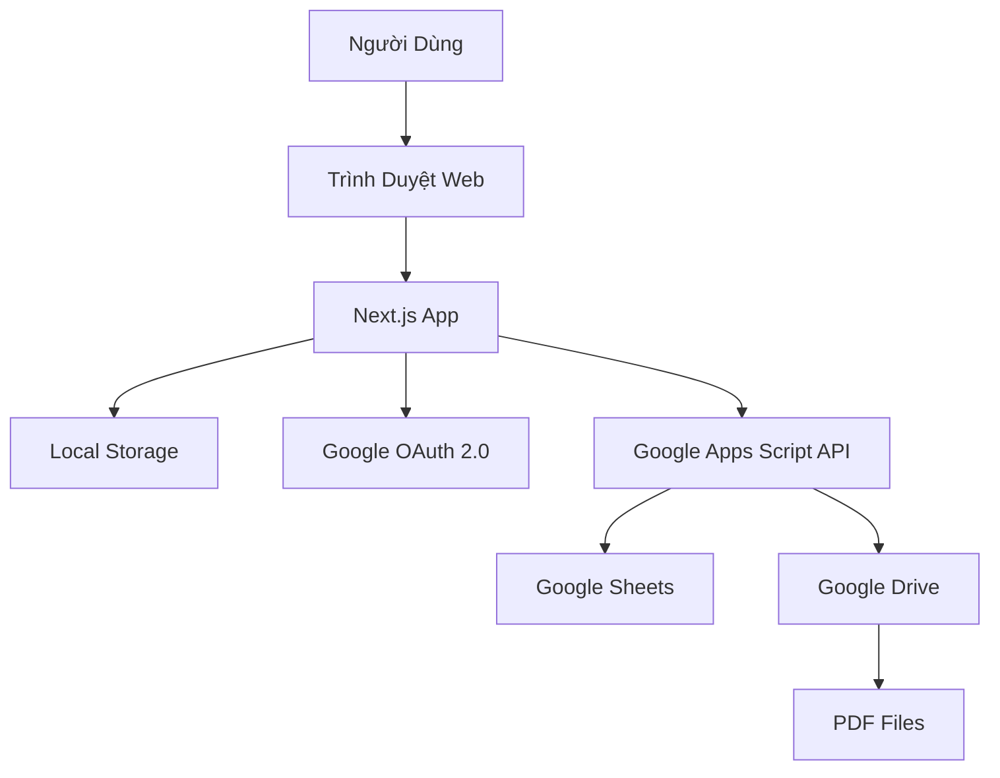

# Tài Liệu Thiết Kế - Web App Quản Lý Chi Tiêu Mua Sắm

## Tổng Quan

Web app quản lý chi tiêu mua sắm là một ứng dụng web single-page được xây dựng bằng Next.js, cho phép người dùng ghi chép các món hàng đã mua, tính toán tổng chi phí, và xuất báo cáo lên Google Sheets hoặc PDF lưu trên Google Drive. Ứng dụng sử dụng kiến trúc client-side rendering với tích hợp Google Apps Script làm backend để xử lý việc tạo và lưu trữ báo cáo.

### Công Nghệ Sử Dụng

- **Frontend Framework**: Next.js 14+ (App Router)
- **Styling**: Tailwind CSS
- **State Management**: React Hooks (useState, useEffect)
- **Storage**: Browser Local Storage
- **Backend**: Google Apps Script (deployed as Web App)
- **Authentication**: Google OAuth 2.0
- **Deployment**: Vercel
- **Language**: TypeScript

### Luồng Hoạt Động Chính

1. Người dùng truy cập ứng dụng và đăng nhập bằng Google Account
2. Người dùng nhập các món hàng (tên + giá) vào form
3. Dữ liệu được lưu tạm vào Local Storage
4. Người dùng xem danh sách món hàng và tổng chi phí real-time
5. Người dùng nhấn "Lưu" để gửi dữ liệu đến Google Apps Script
6. Google Apps Script tạo/cập nhật Google Sheets và tùy chọn xuất PDF
7. Hệ thống trả về kết quả và xóa dữ liệu tạm

## Kiến Trúc

### Kiến Trúc Tổng Thể



### Kiến Trúc Frontend (Next.js)

```
app/
├── layout.tsx              # Root layout với font và metadata
├── page.tsx                # Trang chính của ứng dụng
├── components/
│   ├── ItemForm.tsx        # Form nhập món hàng
│   ├── ItemList.tsx        # Danh sách món hàng
│   ├── Summary.tsx         # Tổng kết chi phí
│   ├── SaveButton.tsx      # Nút lưu với loading state
│   └── AuthButton.tsx      # Nút đăng nhập/đăng xuất
├── lib/
│   ├── storage.ts          # Local Storage utilities
│   ├── googleAuth.ts       # Google OAuth logic
│   ├── gasClient.ts        # Client gọi Google Apps Script
│   └── validation.ts       # Validation logic
└── types/
    └── index.ts            # TypeScript type definitions
```

### Kiến Trúc Backend (Google Apps Script)

```
Code.gs                     # Main script file
├── doPost()               # Endpoint nhận dữ liệu từ frontend
├── createReport()         # Tạo báo cáo trên Google Sheets
├── exportToPDF()          # Xuất PDF và lưu vào Drive
└── formatCurrency()       # Format số tiền theo VN
```

## Các Thành Phần và Giao Diện

### 1. Frontend Components

#### ItemForm Component

**Mục đích**: Form nhập thông tin món hàng

**Props**:
```typescript
interface ItemFormProps {
  onAddItem: (item: ShoppingItem) => void;
}
```

**State**:
- `itemName: string` - Tên món hàng
- `itemPrice: string` - Giá món hàng (string để xử lý input)
- `errors: { name?: string; price?: string }` - Lỗi validation

**Chức năng**:
- Validate tên món hàng không được rỗng
- Validate giá phải là số dương
- Hiển thị lỗi validation bằng tiếng Việt
- Reset form sau khi thêm thành công
- Hỗ trợ Enter để submit

#### ItemList Component

**Mục đích**: Hiển thị danh sách món hàng với khả năng chỉnh sửa/xóa

**Props**:
```typescript
interface ItemListProps {
  items: ShoppingItem[];
  onUpdateItem: (id: string, item: Partial<ShoppingItem>) => void;
  onDeleteItem: (id: string) => void;
}
```

**Chức năng**:
- Hiển thị bảng với cột: STT, Tên món hàng, Giá, Hành động
- Inline editing cho tên và giá
- Nút xóa với confirmation
- Format giá theo VN (1.000.000 ₫)
- Responsive design cho mobile

#### Summary Component

**Mục đích**: Hiển thị tổng kết chi phí

**Props**:
```typescript
interface SummaryProps {
  items: ShoppingItem[];
}
```

**Chức năng**:
- Tính tổng chi phí từ danh sách món hàng
- Hiển thị số lượng món hàng
- Format số tiền theo VN
- Highlight tổng chi phí

#### SaveButton Component

**Mục đích**: Nút lưu dữ liệu lên Google Sheets/Drive

**Props**:
```typescript
interface SaveButtonProps {
  items: ShoppingItem[];
  onSaveSuccess: () => void;
  onSaveError: (error: string) => void;
}
```

**State**:
- `isLoading: boolean` - Trạng thái đang lưu
- `isSaved: boolean` - Đã lưu thành công

**Chức năng**:
- Disable khi danh sách rỗng
- Hiển thị loading spinner khi đang lưu
- Gọi Google Apps Script API
- Xử lý success/error states
- Hiển thị toast notification

#### AuthButton Component

**Mục đích**: Xử lý đăng nhập/đăng xuất Google

**State**:
- `isAuthenticated: boolean` - Trạng thái đăng nhập
- `userEmail: string | null` - Email người dùng

**Chức năng**:
- Hiển thị nút "Đăng nhập với Google" khi chưa auth
- Hiển thị email và nút "Đăng xuất" khi đã auth
- Sử dụng Google OAuth 2.0
- Lưu token vào session storage

### 2. Library Modules

#### storage.ts

**Chức năng**: Quản lý Local Storage

```typescript
export interface ShoppingItem {
  id: string;
  name: string;
  price: number;
  createdAt: string;
}

export const StorageService = {
  // Lưu danh sách món hàng
  saveItems(items: ShoppingItem[]): void;
  
  // Lấy danh sách món hàng
  getItems(): ShoppingItem[];
  
  // Xóa tất cả món hàng
  clearItems(): void;
  
  // Lưu thời gian phiên mua sắm
  saveSessionTime(time: string): void;
  
  // Lấy thời gian phiên mua sắm
  getSessionTime(): string | null;
}
```

#### validation.ts

**Chức năng**: Validation logic

```typescript
export const ValidationService = {
  // Validate tên món hàng
  validateItemName(name: string): { valid: boolean; error?: string };
  
  // Validate giá
  validatePrice(price: string): { valid: boolean; error?: string; value?: number };
  
  // Validate danh sách trước khi lưu
  validateItemList(items: ShoppingItem[]): { valid: boolean; error?: string };
}
```

**Quy tắc validation**:
- Tên món hàng: không rỗng, không chỉ chứa khoảng trắng, tối đa 200 ký tự
- Giá: phải là số, lớn hơn 0, nhỏ hơn 1 tỷ (1,000,000,000)

#### googleAuth.ts

**Chức năng**: Xử lý Google OAuth 2.0

```typescript
export const GoogleAuthService = {
  // Khởi tạo Google OAuth client
  initialize(clientId: string): Promise<void>;
  
  // Đăng nhập
  signIn(): Promise<{ email: string; accessToken: string }>;
  
  // Đăng xuất
  signOut(): Promise<void>;
  
  // Kiểm tra trạng thái đăng nhập
  isAuthenticated(): boolean;
  
  // Lấy access token hiện tại
  getAccessToken(): string | null;
}
```

#### gasClient.ts

**Chức năng**: Client gọi Google Apps Script

```typescript
export interface SaveReportRequest {
  items: ShoppingItem[];
  timestamp: string;
  totalAmount: number;
  exportPDF: boolean;
}

export interface SaveReportResponse {
  success: boolean;
  sheetUrl?: string;
  pdfUrl?: string;
  error?: string;
}

export const GASClient = {
  // Lưu báo cáo
  saveReport(
    request: SaveReportRequest,
    accessToken: string
  ): Promise<SaveReportResponse>;
}
```

### 3. Google Apps Script

#### Main Functions

**doPost(e)**
- Nhận POST request từ frontend
- Parse JSON body
- Validate access token
- Gọi createReport()
- Tùy chọn gọi exportToPDF()
- Trả về JSON response

**createReport(data)**
- Mở hoặc tạo Google Sheets
- Tạo sheet mới với tên là timestamp
- Ghi header: "Báo Cáo Chi Tiêu Mua Sắm"
- Ghi ngày giờ
- Ghi bảng món hàng (STT | Tên món hàng | Giá)
- Ghi tổng chi phí
- Format cells (bold headers, currency format, borders)
- Trả về URL của sheet

**exportToPDF(spreadsheetId, sheetId)**
- Sử dụng Drive API để export sheet thành PDF
- Lấy folder ID từ Script Properties
- Tạo tên file: "Chi_Tieu_YYYYMMDD_HHMMSS.pdf"
- Lưu PDF vào folder
- Trả về URL của PDF file

**formatCurrency(amount)**
- Format số theo định dạng VN: 1.000.000 ₫
- Sử dụng Utilities.formatString()

## Mô Hình Dữ Liệu

### ShoppingItem

Đại diện cho một món hàng trong danh sách mua sắm.

```typescript
interface ShoppingItem {
  id: string;              // UUID v4
  name: string;            // Tên món hàng (1-200 ký tự)
  price: number;           // Giá (> 0, < 1,000,000,000)
  createdAt: string;       // ISO 8601 timestamp
}
```

**Invariants**:
- `id` phải là UUID hợp lệ và duy nhất
- `name` không được rỗng sau khi trim
- `price` phải là số dương
- `createdAt` phải là ISO 8601 timestamp hợp lệ

### ShoppingSession

Đại diện cho một phiên mua sắm (lưu trong Local Storage).

```typescript
interface ShoppingSession {
  items: ShoppingItem[];   // Danh sách món hàng
  startTime: string;       // Thời gian bắt đầu phiên (ISO 8601)
  lastModified: string;    // Thời gian chỉnh sửa cuối (ISO 8601)
}
```

### SaveReportRequest

Dữ liệu gửi đến Google Apps Script.

```typescript
interface SaveReportRequest {
  items: ShoppingItem[];   // Danh sách món hàng
  timestamp: string;       // Thời gian tạo báo cáo (ISO 8601)
  totalAmount: number;     // Tổng chi phí
  exportPDF: boolean;      // Có xuất PDF không
}
```

### SaveReportResponse

Response từ Google Apps Script.

```typescript
interface SaveReportResponse {
  success: boolean;        // Thành công hay không
  sheetUrl?: string;       // URL của Google Sheet (nếu thành công)
  pdfUrl?: string;         // URL của PDF (nếu exportPDF = true)
  error?: string;          // Thông báo lỗi (nếu thất bại)
}
```

### Google Sheets Structure

Cấu trúc của báo cáo trên Google Sheets:

```
Row 1: [Merge A1:C1] "BÁO CÁO CHI TIÊU MUA SẮM" (Bold, Center, Size 14)
Row 2: [Merge A2:C2] "Ngày: DD/MM/YYYY HH:MM" (Italic)
Row 3: [Empty]
Row 4: ["STT" | "Tên món hàng" | "Giá"] (Bold, Background color)
Row 5+: [1 | "Cà chua" | "20.000 ₫"]
       [2 | "Thịt heo" | "150.000 ₫"]
       ...
Last Row: [Merge A:B] "TỔNG CỘNG" (Bold) | "170.000 ₫" (Bold, Red)
```

### Environment Variables

```
# .env.local (Next.js)
NEXT_PUBLIC_GOOGLE_CLIENT_ID=xxx
NEXT_PUBLIC_GAS_WEB_APP_URL=https://script.google.com/macros/s/xxx/exec

# Script Properties (Google Apps Script)
DRIVE_FOLDER_ID=xxx
SPREADSHEET_ID=xxx (optional, tạo mới nếu không có)
```


## Thuộc Tính Đúng Đắn (Correctness Properties)

*Thuộc tính (property) là một đặc điểm hoặc hành vi phải đúng trong mọi trường hợp thực thi hợp lệ của hệ thống - về cơ bản, đó là một phát biểu chính thức về những gì hệ thống nên làm. Các thuộc tính đóng vai trò là cầu nối giữa đặc tả có thể đọc được bởi con người và các đảm bảo tính đúng đắn có thể xác minh được bởi máy móc.*

### Property 1: Thêm món hàng hợp lệ làm tăng danh sách

*For any* danh sách món hàng và món hàng hợp lệ (tên không rỗng, giá > 0), khi thêm món hàng vào danh sách, độ dài danh sách phải tăng lên 1 và món hàng mới phải xuất hiện trong danh sách.

**Validates: Requirements 1.1, 1.4**

### Property 2: Validation từ chối giá không hợp lệ

*For any* chuỗi đầu vào không phải là số dương (chuỗi không phải số, số âm, số 0, null, undefined), hàm validation giá phải trả về lỗi và không cho phép tạo món hàng.

**Validates: Requirements 1.2**

### Property 3: Validation từ chối tên rỗng

*For any* chuỗi chỉ chứa khoảng trắng hoặc rỗng (bao gồm "", "   ", "\t", "\n"), hàm validation tên phải trả về lỗi và không cho phép tạo món hàng.

**Validates: Requirements 1.3**

### Property 4: Tổng chi phí luôn bằng tổng của tất cả món hàng

*For any* danh sách món hàng, tổng chi phí được tính phải bằng tổng của tất cả giá món hàng trong danh sách. Điều này phải đúng sau mọi thao tác: thêm, xóa, hoặc chỉnh sửa món hàng.

**Validates: Requirements 1.5, 2.1, 2.2**

### Property 5: Xóa món hàng loại bỏ nó khỏi danh sách

*For any* danh sách món hàng không rỗng và một món hàng bất kỳ trong danh sách, khi xóa món hàng đó, độ dài danh sách phải giảm 1 và món hàng đó không còn xuất hiện trong danh sách.

**Validates: Requirements 2.1**

### Property 6: Chỉnh sửa món hàng cập nhật thông tin

*For any* món hàng trong danh sách và giá trị mới hợp lệ, khi chỉnh sửa món hàng, thông tin món hàng trong danh sách phải phản ánh giá trị mới.

**Validates: Requirements 2.2**

### Property 7: Thay đổi state kích hoạt re-render UI

*For any* thao tác thay đổi danh sách món hàng (thêm, xóa, chỉnh sửa), UI phải được render lại với dữ liệu mới nhất.

**Validates: Requirements 2.3**

### Property 8: Dữ liệu gửi đến API đầy đủ và đúng format

*For any* danh sách món hàng, khi gọi hàm lưu báo cáo, request gửi đến Google Apps Script phải chứa: danh sách món hàng, timestamp, tổng chi phí, và flag exportPDF, tất cả đều đúng kiểu dữ liệu.

**Validates: Requirements 3.1**

### Property 9: Báo cáo chứa đầy đủ thông tin bắt buộc

*For any* dữ liệu báo cáo được tạo (Google Sheets hoặc PDF), báo cáo phải chứa: ngày giờ, danh sách đầy đủ các món hàng với tên và giá, và tổng chi phí.

**Validates: Requirements 3.3, 4.4**

### Property 10: Format số tiền theo chuẩn Việt Nam

*For any* số tiền (số nguyên dương), hàm format currency phải trả về chuỗi có dấu chấm (.) ngăn cách hàng nghìn và ký hiệu "₫" ở cuối. Ví dụ: 1000000 → "1.000.000 ₫".

**Validates: Requirements 5.2**

### Property 11: Format ngày giờ theo chuẩn Việt Nam

*For any* timestamp hợp lệ, hàm format date phải trả về chuỗi theo định dạng "dd/mm/yyyy" hoặc "dd/mm/yyyy HH:MM".

**Validates: Requirements 5.3**

### Property 12: Tất cả text UI sử dụng tiếng Việt

*For any* component UI được render, tất cả text hiển thị (labels, buttons, messages) phải chứa ký tự tiếng Việt và không chứa text tiếng Anh (trừ technical terms như "Google", "PDF").

**Validates: Requirements 5.1**

### Property 13: Local Storage round-trip bảo toàn dữ liệu

*For any* danh sách món hàng, khi lưu vào Local Storage và sau đó đọc lại, dữ liệu đọc được phải tương đương với dữ liệu ban đầu (same items, same order, same values).

**Validates: Requirements 8.1, 8.2**

### Property 14: Lưu thành công xóa Local Storage

*For any* danh sách món hàng trong Local Storage, khi lưu thành công lên Google Sheets, Local Storage phải được xóa sạch (không còn dữ liệu món hàng).

**Validates: Requirements 8.3**

### Property 15: Xóa tất cả làm rỗng danh sách

*For any* danh sách món hàng không rỗng, khi người dùng thực hiện hành động "xóa tất cả", danh sách phải trở thành rỗng và Local Storage phải được xóa.

**Validates: Requirements 8.4**

### Property 16: Chỉ user đã xác thực mới gọi được API

*For any* API call đến Google Apps Script, request phải chứa access token hợp lệ, nếu không API phải trả về lỗi 401 Unauthorized.

**Validates: Requirements 7.2**

### Property 17: PDF được tạo khi flag exportPDF = true

*For any* request lưu báo cáo với exportPDF = true, response phải chứa pdfUrl và file PDF phải được tạo trong Google Drive.

**Validates: Requirements 4.1, 4.2**

## Xử Lý Lỗi

### Lỗi Validation

**Lỗi tên món hàng không hợp lệ**:
- Trigger: Tên rỗng hoặc chỉ chứa khoảng trắng
- Response: Hiển thị message "Vui lòng nhập tên món hàng" màu đỏ dưới input
- Action: Không thêm món hàng, focus vào input tên

**Lỗi giá không hợp lệ**:
- Trigger: Giá không phải số, số âm, hoặc số 0
- Response: Hiển thị message "Giá phải là số dương" màu đỏ dưới input
- Action: Không thêm món hàng, focus vào input giá

**Lỗi giá quá lớn**:
- Trigger: Giá >= 1,000,000,000
- Response: Hiển thị message "Giá không được vượt quá 1 tỷ đồng"
- Action: Không thêm món hàng

### Lỗi Authentication

**Lỗi chưa đăng nhập**:
- Trigger: User chưa authenticate với Google
- Response: Hiển thị modal "Vui lòng đăng nhập để sử dụng tính năng này"
- Action: Hiển thị nút "Đăng nhập với Google"

**Lỗi token hết hạn**:
- Trigger: Access token expired khi gọi API
- Response: Hiển thị toast "Phiên đăng nhập đã hết hạn"
- Action: Tự động redirect đến login flow

**Lỗi quyền truy cập**:
- Trigger: User không cấp quyền Sheets/Drive
- Response: Hiển thị modal "Ứng dụng cần quyền truy cập Google Sheets và Drive để hoạt động"
- Action: Nút "Cấp quyền" để retry OAuth flow

### Lỗi API/Network

**Lỗi kết nối mạng**:
- Trigger: Network request failed
- Response: Toast "Không thể kết nối. Vui lòng kiểm tra kết nối mạng"
- Action: Giữ nguyên dữ liệu trong Local Storage, cho phép retry

**Lỗi Google Apps Script timeout**:
- Trigger: Request timeout sau 30s
- Response: Toast "Yêu cầu mất quá nhiều thời gian. Vui lòng thử lại"
- Action: Giữ nguyên dữ liệu, nút "Thử lại"

**Lỗi Google Apps Script internal error**:
- Trigger: GAS trả về error 500
- Response: Toast "Đã xảy ra lỗi khi lưu. Vui lòng thử lại sau"
- Action: Log error details to console, giữ nguyên dữ liệu

**Lỗi không tìm thấy folder Drive**:
- Trigger: DRIVE_FOLDER_ID không tồn tại hoặc không có quyền
- Response: "Không thể lưu PDF. Vui lòng liên hệ quản trị viên"
- Action: Vẫn lưu được Google Sheets, chỉ không tạo PDF

### Lỗi Local Storage

**Lỗi Local Storage đầy**:
- Trigger: QuotaExceededError khi lưu
- Response: Toast "Bộ nhớ trình duyệt đã đầy. Vui lòng xóa dữ liệu cũ"
- Action: Hiển thị nút "Xóa dữ liệu cũ" để clear Local Storage

**Lỗi Local Storage bị disabled**:
- Trigger: Local Storage không available (private mode)
- Response: Warning banner "Chế độ riêng tư: Dữ liệu sẽ không được lưu tạm"
- Action: Ứng dụng vẫn hoạt động nhưng không có auto-save

### Lỗi Dữ Liệu

**Lỗi dữ liệu Local Storage bị corrupt**:
- Trigger: JSON.parse failed khi đọc Local Storage
- Response: Toast "Dữ liệu cũ không hợp lệ. Đã xóa và bắt đầu mới"
- Action: Clear Local Storage, bắt đầu với danh sách rỗng

**Lỗi danh sách rỗng khi lưu**:
- Trigger: User nhấn "Lưu" khi chưa có món hàng nào
- Response: Toast "Vui lòng thêm ít nhất một món hàng"
- Action: Disable nút "Lưu" khi danh sách rỗng

## Chiến Lược Kiểm Thử

### Tổng Quan

Chiến lược kiểm thử sử dụng kết hợp hai phương pháp bổ trợ cho nhau:

1. **Unit Tests**: Kiểm tra các trường hợp cụ thể, edge cases, và điều kiện lỗi
2. **Property-Based Tests**: Kiểm tra các thuộc tính tổng quát trên nhiều đầu vào ngẫu nhiên

Cả hai đều cần thiết để đảm bảo độ bao phủ toàn diện:
- Unit tests phát hiện các bug cụ thể và đảm bảo các trường hợp quan trọng hoạt động đúng
- Property tests xác minh tính đúng đắn tổng quát và phát hiện các edge cases không ngờ tới

### Thư Viện Kiểm Thử

**Framework**: Jest + React Testing Library
**Property-Based Testing**: fast-check (thư viện PBT cho JavaScript/TypeScript)
**Mocking**: MSW (Mock Service Worker) cho API calls

### Cấu Hình Property-Based Tests

- Mỗi property test chạy tối thiểu **100 iterations** với dữ liệu ngẫu nhiên
- Mỗi test phải có comment tag: **Feature: shopping-expense-tracker, Property {number}: {property_text}**
- Mỗi correctness property phải được implement bởi ĐÚNG MỘT property-based test

### Chiến Lược Kiểm Thử Theo Module

#### 1. Validation Module (lib/validation.ts)

**Property-Based Tests**:
- Property 2: Test với 100+ chuỗi giá không hợp lệ ngẫu nhiên
- Property 3: Test với 100+ chuỗi tên rỗng/whitespace ngẫu nhiên

**Unit Tests**:
- Test các trường hợp biên: giá = 0, giá = 999,999,999, giá = 1,000,000,000
- Test các ký tự đặc biệt trong tên: emoji, ký tự Unicode
- Test tên dài: 1 ký tự, 200 ký tự, 201 ký tự

#### 2. Storage Module (lib/storage.ts)

**Property-Based Tests**:
- Property 13: Test round-trip với 100+ danh sách món hàng ngẫu nhiên
- Property 14: Test xóa Local Storage sau save thành công

**Unit Tests**:
- Test Local Storage không available (mock)
- Test dữ liệu corrupt trong Local Storage
- Test QuotaExceededError

#### 3. Item Management Logic

**Property-Based Tests**:
- Property 1: Test thêm món hàng với 100+ món hàng ngẫu nhiên
- Property 4: Test tổng chi phí với 100+ danh sách ngẫu nhiên (thêm/xóa/sửa)
- Property 5: Test xóa món hàng với 100+ danh sách ngẫu nhiên
- Property 6: Test chỉnh sửa món hàng với 100+ giá trị mới ngẫu nhiên
- Property 15: Test xóa tất cả với 100+ danh sách ngẫu nhiên

**Unit Tests**:
- Test thêm món hàng vào danh sách rỗng
- Test xóa món hàng cuối cùng
- Test chỉnh sửa món hàng không tồn tại

#### 4. Formatting Module

**Property-Based Tests**:
- Property 10: Test format currency với 100+ số ngẫu nhiên (0 - 1 tỷ)
- Property 11: Test format date với 100+ timestamps ngẫu nhiên

**Unit Tests**:
- Test format số đặc biệt: 0, 1, 999, 1000, 1000000
- Test format ngày đặc biệt: 01/01/2024, 31/12/2024, 29/02/2024

#### 5. Google Apps Script Client (lib/gasClient.ts)

**Property-Based Tests**:
- Property 8: Test request payload với 100+ danh sách ngẫu nhiên

**Unit Tests**:
- Test với mock successful response
- Test với mock error responses (400, 401, 500, timeout)
- Test retry logic
- Test với access token hết hạn

#### 6. UI Components

**Property-Based Tests**:
- Property 7: Test re-render với 100+ state changes ngẫu nhiên
- Property 12: Test text tiếng Việt trong tất cả components

**Unit Tests**:
- Test ItemForm: submit với Enter key, validation errors display
- Test ItemList: render empty state, render với nhiều items
- Test Summary: hiển thị đúng tổng, hiển thị số lượng items
- Test SaveButton: disabled state, loading state, success/error states
- Test AuthButton: authenticated/unauthenticated states

#### 7. Integration Tests

**Unit Tests** (không phải property tests):
- Test luồng hoàn chỉnh: thêm items → lưu → xóa Local Storage
- Test luồng authentication: login → save → logout
- Test luồng error recovery: network error → retry → success

### Generators cho Property-Based Tests

Sử dụng fast-check để tạo dữ liệu ngẫu nhiên:

```typescript
// Generator cho ShoppingItem hợp lệ
const validItemArb = fc.record({
  id: fc.uuid(),
  name: fc.string({ minLength: 1, maxLength: 200 }).filter(s => s.trim().length > 0),
  price: fc.integer({ min: 1, max: 999999999 }),
  createdAt: fc.date().map(d => d.toISOString())
});

// Generator cho tên không hợp lệ
const invalidNameArb = fc.oneof(
  fc.constant(""),
  fc.constant("   "),
  fc.constant("\t\n"),
  fc.stringOf(fc.constantFrom(" ", "\t", "\n"))
);

// Generator cho giá không hợp lệ
const invalidPriceArb = fc.oneof(
  fc.constant("abc"),
  fc.constant(""),
  fc.integer({ max: 0 }),
  fc.constant(null),
  fc.constant(undefined)
);

// Generator cho danh sách món hàng
const itemListArb = fc.array(validItemArb, { minLength: 0, maxLength: 50 });
```

### Coverage Goals

- **Line Coverage**: >= 90%
- **Branch Coverage**: >= 85%
- **Function Coverage**: >= 95%
- **Property Coverage**: 100% (tất cả 17 properties phải có tests)

### CI/CD Integration

- Tests chạy tự động trên mỗi commit
- Property tests chạy với seed cố định để reproducible
- Failing tests block deployment
- Coverage report được upload lên Codecov

### Test Organization

```
__tests__/
├── unit/
│   ├── validation.test.ts
│   ├── storage.test.ts
│   ├── formatting.test.ts
│   ├── gasClient.test.ts
│   └── components/
│       ├── ItemForm.test.tsx
│       ├── ItemList.test.tsx
│       ├── Summary.test.tsx
│       ├── SaveButton.test.tsx
│       └── AuthButton.test.tsx
├── properties/
│   ├── validation.properties.test.ts
│   ├── storage.properties.test.ts
│   ├── itemManagement.properties.test.ts
│   ├── formatting.properties.test.ts
│   └── ui.properties.test.ts
└── integration/
    ├── fullFlow.test.tsx
    └── errorRecovery.test.tsx
```

### Example Property Test

```typescript
// Feature: shopping-expense-tracker, Property 4: Tổng chi phí luôn bằng tổng của tất cả món hàng
describe('Property 4: Total amount calculation', () => {
  it('should always equal sum of all item prices', () => {
    fc.assert(
      fc.property(itemListArb, (items) => {
        const expectedTotal = items.reduce((sum, item) => sum + item.price, 0);
        const actualTotal = calculateTotal(items);
        expect(actualTotal).toBe(expectedTotal);
      }),
      { numRuns: 100 }
    );
  });
});
```
